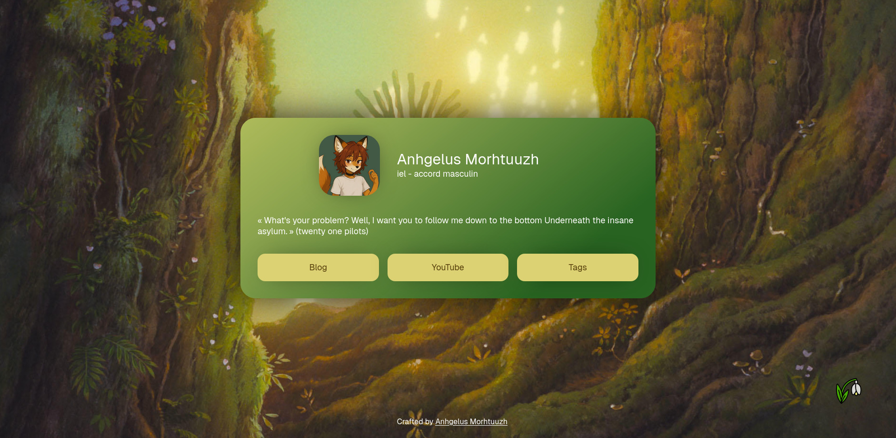
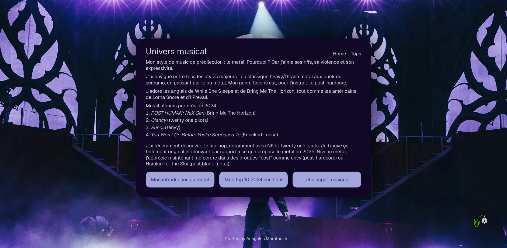

# Now
Self-hostable bio page website, like carrd, guns.lol and many more!

Lightweight and heavily customizable Go application.





## Installation

Dependencies:
- Go 1.24+
- Bun
- just

Clone the repository:
```bash
git clone https://git.anhgelus.world/anhgelus/now.git
cd now 
```

Build the project with just:
```bash
just build
```

You can also manually build it by reading the content of `justfile` and executing the command.

The `now` binary produced contains everything needed and can be executed on the same OS with the same arch.
Execute it with the flag `-help` to get the list of available options.

## Config
You must have a `public` directory.
Everything located inside will be available at the path `/static/PATH` where `PATH` is the relative path inside the
`public` directory.

### Main config
You can create a sample config with the flag `-generate-json-config` (which generates a JSON config) or with 
`-generate-toml-config` (which generates a TOML config).

The config does not depend on the markup language: a field `foo` will being named `foo` for JSON and TOML.
The TOML format is used in this section.

The root is defining the background image, the description, the file's path to the legal pages, the path to the custom 
font (you can remove this if you want to use `Raveo, Inter, Roboto` as default fonts), the path to the configs of custom
pages and a list of all your ["rel-me"](https://microformats.org/wiki/rel-me) links. 
(The "rel-me" links are required to 
[verify a link on your Mastodon account](https://docs.joinmastodon.org/user/profile/#verification), for example.)
```toml
image = "wallpaper.webp"
description = "I am a beautiful description!"
legal = "legal.html"
font = ""
custom_pages = ["custom.toml"]
rel_me_links = ["https://foo.example.org/@bar"]
```
The path is relative to the execution of the binary, except for `image` and `font` which are relative to the `public` 
folder.
If you are using Docker, please use a static path.

The first section is defining who you are.
`image` is your pfp.
It must be placed inside the `public` directory.
```toml
[person]
  name = "John Doe"
  pronouns = "any"
  image = "pfp.webp"

  [[person.tags]]
    name = "Hello"
    description = "World"
    link = ""

  [[person.tags]]
    name = "I am"
    description = "a tag"
    link = ""
```

Then, you define the colors of the main page.
`text` is the text's color.
`tag_hover` is the background's color of a tag when someone hover it.
`colors.background` defines the card's background (check the CSS property `gradiant` on 
[MDN](https://developer.mozilla.org/en-US/docs/Web/CSS/gradient) to have more information).
`colors.buttons` defines buttons' colors.
```toml
[colors]
  text = "#fff"
  tag_hover = "#000"
  [colors.background]
    type = "linear"
    angle = 141

    [[colors.background.colors]]
      color = "#a4a2b8"
      position = 0

    [[colors.background.colors]]
      color = "#3b3860"
      position = 40

    [[colors.background.colors]]
      color = "#0f0c2c"
      position = 80
  [colors.buttons]
    text = "#4c0850"
    text_hover = "#57145b"
    background = "#f399d0"
    background_hover = "#f5c0e0"
```

Finally, you define the link at the bottom of your card.
You can have as much of these as you want. 
```toml
[[links]]
  link = "/foo"
  content = "Blog"

[[links]]
  link = "https://www.youtube.com/@anhgelus"
  content = "YouTube"
```

Optionally, you can add webring(s) to your page.
```toml
[[rings]]
  image = "foo-ring.webp"
  link = "ring.example.org"
  name = "Foo ring"
```

### Custom page config
You can create custom pages with a new config.
It can also be a JSON or a TOML file.

The root defines the title of the page, the uri (must be unique!), the image and the description.
`content` is the file's path containing the content of your custom page.
```toml
title = "Foo"
uri = "/bar"
image = "wallpaper.webp"
description = "I am a beautiful description!"
content = "foo-bar.html"
```

Then, you can define custom colors.
Check _Main config_'s colors section for more information.
The `tag_hover` field is useless here.

### HTML content files
When you define a custom page or when you have to set the legal information, you have to specify the path of an HTML 
file.
It contains the content that would be displayed in the page.
You can use all HTML common tags like `h2`, `p` and `a`.
(`h1` is already used by the title.)

If you want to use buttons, you must follow this structure:
```html
<nav class="links">
    <div class="link">
        <a href="/">home sweet home</a>
    </div>
    <div class="link">
        <a href="/foo">Bar</a>
    </div>
</nav>
```
Their style is defined by the config.
You can change their style by defining these CSS variables `--text-color`, `--text-color-hover`, `--background` and 
`--background-hover`.

## Technologies used

- [anhgelus/golatt](https://github.com/anhgelus/golatt)
- Bun
